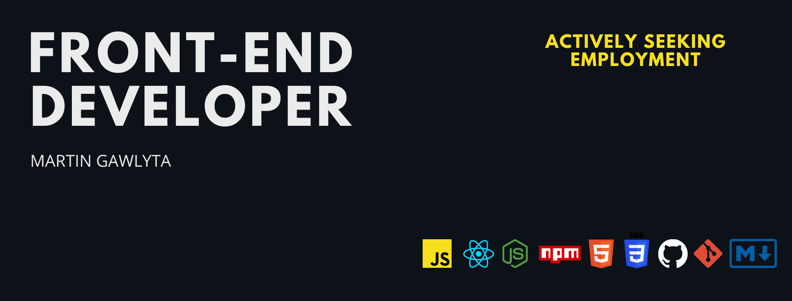
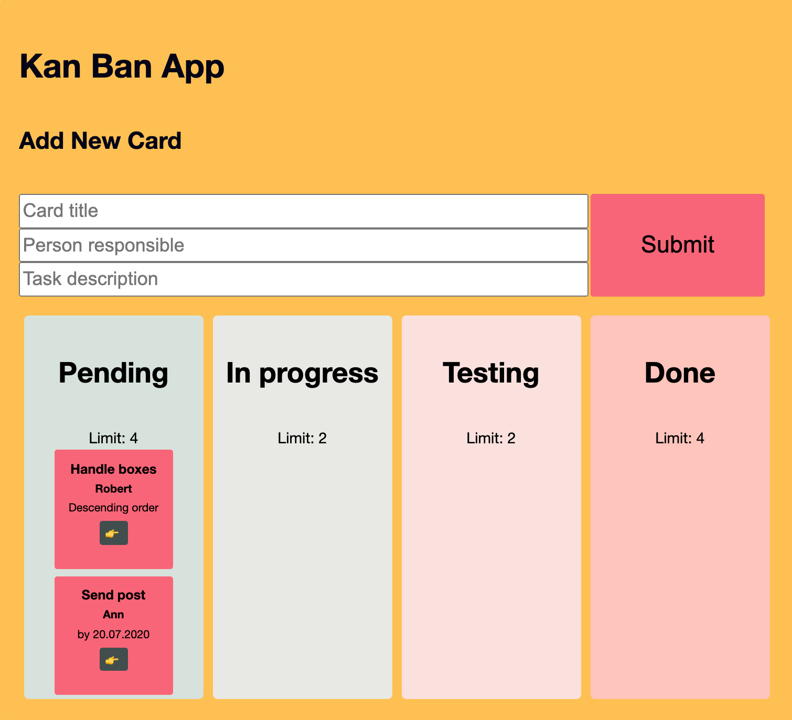
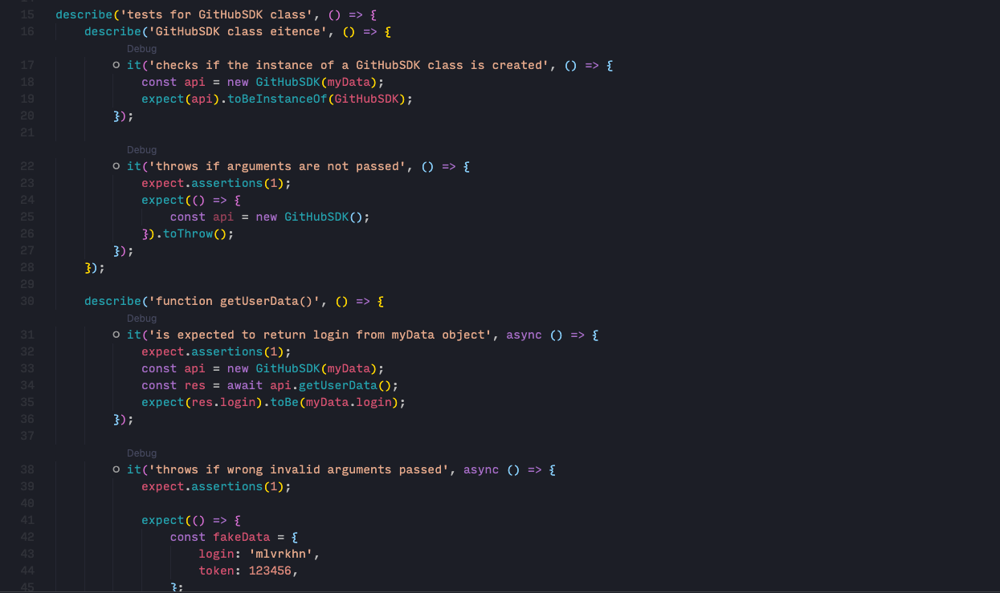

## Solution-oriented Front-Web Developer with background in Law. Working with JavaScript, Node.js, React.js and Redux. 

---

## Latest projects

### KANBAN - japanese task management tool

### About 
- web app architectre implementing Kanban management tool,
- communication via custom hook useLocalStorage with browsers memory,
- build with functional components and state management using React Hooks (useEffect, useState, useContex, useRef, etc.).
  
[See the code](https://github.com/mlvrkhn/kanban_task_management_app/tree/master/kan-ban-san)

---
### Software Development Kit for Github with Unit Testing

  

- Unit Testing in accordance with TDD using Jest library,
- create an client/SDK working with GitHub API that performs certain operations on repositories and account settings,
- communicate with Restful API using secure token Authorization.

[See the code](https://github.com/mlvrkhn/SDK_GitHub_UnitTesting)

---
### Excursion manager
  
- build a simple JSON database and implement a excursion ordering system with basket utility,
- build data validator, API handler,
- use full power of tools like Webpack, Babel, Linter,
- create Excursion Manager to handle the system.

[See the code](https://github.com/mlvrkhn/excursion_manager)