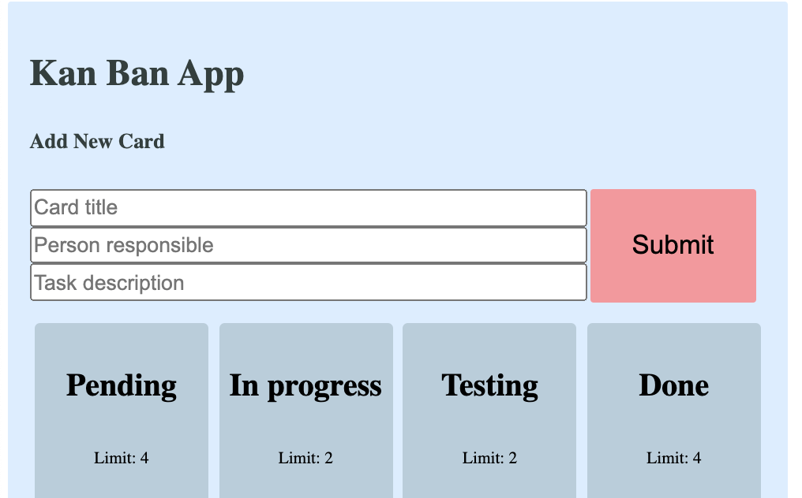

## **Hey hey!** 👋

My name is Martin, I am a software developer with a background in Law. I am self taught and I work mostly on the Front End with JavaScript and React.js.

<table>
  <tr>
    <td><h3>About me</h3></td>
    <td><h3>Things I like</h3></td>
  </tr>
  <tr>
    <td>
      <ul>
        <li>👨‍💻 Speaking 🏴󠁧󠁢󠁥󠁮󠁧󠁿  🇳🇴  🇵🇱 learning 🇪🇸</li>
        <li>💻 Shortlist: TypeScript, Svelte, Firebase</li>
        <li>🤓 Perseverant, motivated, involved</li>
      </ul>
    </td>
    <td>
      <ul>
        <li>minimalism ♡</li>
        <li>browsing maps 🗺 and drinking water💧</li>
        <li>reading novels 📙 and spending time outside 🌳</li>
        <li>XIX century 📚</li>
      </ul>
    </td>
  </tr>
</table>

# Currently looking for a job 💼 🤗

## Tech I use:

-     
-      
-       
-   

## My recent projects

<table>
  <tr>
    <td><h3>Search Brønnøysundregisteret</h3></td>
    <td> </td>
  </tr>
  <tr>
    <td>
        <a href="https://mlvrkhn.github.io/bluebird-api/" alt="try_api">Try it out</a>
        or
        <a href="https://github.com/mlvrkhn/bluebird-api" alt="code_api">see the code</a>
      <ul>
        <li>build with React.js and Redux, Webpack and Babel</li>
        <li>dynamic API search separate as a module with error handling, type checking</li>
        <li>neumophic design, external fonts, theme, global styling, created with Styled-Components</li>
        <li>hooks: useState, useEffect, useDispatch, useSelector, etc.</li>
      </ul>
    </td>
    <td></td>
  </tr>

  <tr>
    <td><h3>Headless CMS Blog</h3></td>
    <td> </td>
  </tr>
  <tr>
    <td>
        <a href="https://github.com/mlvrkhn/BlogCMS" alt="blog-link">see the code</a>
      <ul>
        <li>Headless CMS fields to remotely manage blog content</li>
        <li>React Router DOM for Routing</li>
        <li>React Hooks, React Helmet, React Styled Components</li>
      </ul>
    </td>
    <td></td>
  </tr>

  <tr>
    <td><h3>Redux Calendar</h3></td>
    <td> </td>
  </tr>
  <tr>
    <td>
        <a href="https://github.com/mlvrkhn/Redux-Calendar" alt="code_api">see the code</a>
      <ul>
        <li>build with Redux, React, Webpack and Babel</li>
        <li>React Transition Library for animations</li>
        <li>dedicated API for storing data (JSON server)</li>
      </ul>
    </td>
    <td></td>
  </tr>

  <tr>
    <td><h3>Kanban - japanese task management tool</h3></td>
    <td></td>
  </tr>
  <tr>
    <td>
        <a href="https://mlvrkhn.github.io/kanban_task_management_app" alt="kanban-try">Try it out</a>
        or
        <a href="https://github.com/mlvrkhn/kanban_task_management_app/tree/master/kan-ban-san" alt="kanban-code">see the code</a>
      <ul>
        <li>web app architectre implementing Kanban management tool</li>
        <li>communication via custom hook useLocalStorage with browsers memory</li>
        <li>build with functional components and state management using React Hooks (useEffect, useState, useContex, useRef, etc.)</li>
      </ul>
    </td>
    <td></td>
  </tr>

  <tr>
    <td><h3>Software Development Kit for Github + Unit Testing</h3></td>
    <td></td>
  </tr>
  <tr>
    <td>
        <a href="https://github.com/mlvrkhn/SDK_GitHub_UnitTesting" alt="sdk_code">See the code</a>
      <ul>
        <li>Unit Testing in accordance with TDD using Jest library</li>
        <li>create an client/SDK working with GitHub API that performs certain operations on repositories and account settings</li>
        <li>communicate with Restful API using secure token Authorization</li>
      </ul>
    </td>
    <td></td>
  </tr>

  <tr>
    <td><h3>CRUD Excursion Manager</h3></td>
    <td></td>
  </tr>
  <tr>
    <td>
        <a href="https://github.com/mlvrkhn/excursion_manager" alt="github_crud">See the code</a>
      <ul>
        <li>Unit Testing in accordance with TDD using Jest library</li>
        <li>create an client/SDK working with GitHub API that performs certain operations on repositories and account settings</li>
        <li>communicate with Restful API using secure token Authorization</li>
      </ul>
    </td>
  </tr>
</table>

