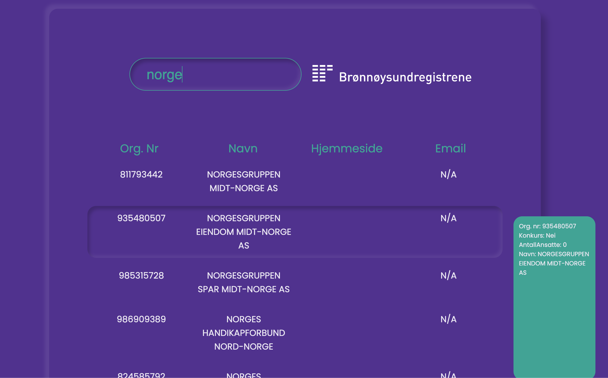
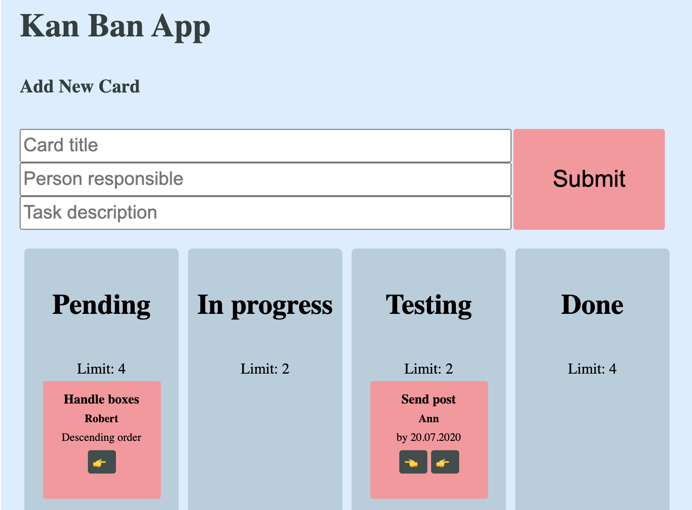

### Solution-oriented Front-Web Developer with background in Law. Working with JavaScript, Node.js, React.js and Redux. 

---

# Latest projects

## Søk mot Brønnøysundregisteret
[Try it out!](https://mlvrkhn.github.io/bluebird-api/) | [See the code](https://github.com/mlvrkhn/bluebird-api) 

### Search Brønnøysundregisteret based on organisasjonsnummer companys name.

- build with React.js and Redux, Webpack and Babel,
- dynamic API search separate as a module with error handling,
- hooks: useState, useEffect, useDispatch, useSelector, etc.
- type checking with PropTypes,
- neumophic design, external fonts, theme, global styling, created with Styled-Components 

----------------------------------------------------------------

## KANBAN - japanese task management tool
[Try it out!](https://mlvrkhn.github.io/kanban_task_management_app/) | [See the code](https://github.com/mlvrkhn/kanban_task_management_app/tree/master/kan-ban-san)

### About 
- web app architectre implementing Kanban management tool,
- communication via custom hook useLocalStorage with browsers memory,
- build with functional components and state management using React Hooks (useEffect, useState, useContex, useRef, etc.).
  

---
## Software Development Kit for Github with Unit Testing
[See the code](https://github.com/mlvrkhn/SDK_GitHub_UnitTesting)

  

- Unit Testing in accordance with TDD using Jest library,
- create an client/SDK working with GitHub API that performs certain operations on repositories and account settings,
- communicate with Restful API using secure token Authorization.

---
## Excursion manager
[See the code](https://github.com/mlvrkhn/excursion_manager)
  
- build a simple JSON database and implement a excursion ordering system with basket utility,
- build data validator, API handler,
- use full power of tools like Webpack, Babel, Linter,
- create Excursion Manager to handle the system.
